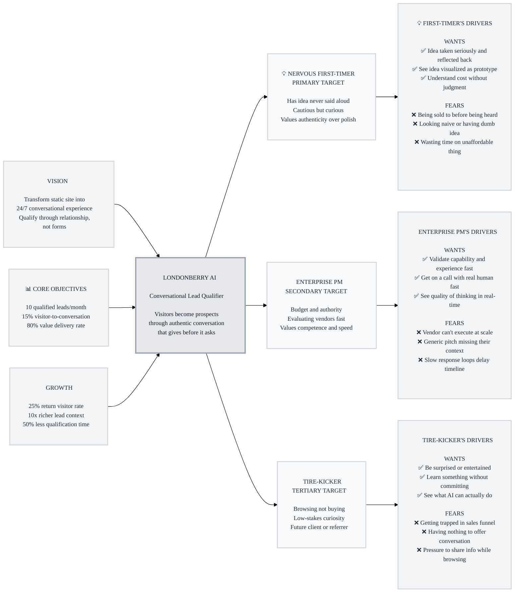

# Trigger Map: Londonberry Conversational AI Widget

> Visual overview connecting business goals to user psychology

**Created:** 2026-04-06
**Author:** Ben McDonald
**Methodology:** Based on Effect Mapping (Balic & Domingues), adapted for WDS framework

---

## Strategic Documents

This is the visual overview. For detailed documentation, see:

- **[01-Business-Goals.md](01-Business-Goals.md)** - Full vision statements and SMART objectives
- **[02-Nervous-First-Timer.md](personas/02-Nervous-First-Timer.md)** - Primary persona with complete driving forces
- **[03-Enterprise-PM.md](personas/03-Enterprise-PM.md)** - Secondary persona with complete driving forces
- **[04-Tire-Kicker.md](personas/04-Tire-Kicker.md)** - Tertiary persona with complete driving forces
- **[05-Key-Insights.md](05-Key-Insights.md)** - Strategic implications and design focus
- **[06-Feature-Impact.md](06-Feature-Impact.md)** - Prioritized features with impact scores

---

## Vision

**Transform londonberry.com from a static brochure into a 24/7 conversational experience that connects with every visitor on a human level — qualifying leads through authentic relationship-building, not forms.**

---

## The Transformation

Every visitor who clicks "Start a conversation" enters as a stranger and leaves having received value. The qualification happens invisibly through emotional resonance — their response to Ben's authenticity, humor, and vulnerability IS the signal. No forms. No funnels. Just conversation.

---

## The Flywheel

1. **Engine:** Authentic conversations generate qualified leads (Nervous First-Timers convert through value exchange)
2. **Amplifier:** Value-first approach builds trust and brand differentiation (every visitor gets something, tells someone)
3. **Intelligence:** Conversation data creates operational leverage (rich context, market insights, time savings)

---

## Target Groups (Prioritized)

### 1. Nervous First-Timer (Primary)

**Priority Reasoning:** Highest conversion potential through emotional journey. Their vulnerability + the value-first approach = natural qualification. The prototype image moment creates shareable stories that drive word-of-mouth.

> Has an idea they've never said out loud. Cautious but curious. Clicked because the site felt approachable. Needs safety before they'll share. Values authenticity over polish. Will disengage at the first sign of a sales pitch.

**Key Positive Drivers:**
- Have idea taken seriously and reflected back with understanding
- See idea visualized — proof it could be real (prototype image)
- Understand cost without judgment (shame-free pricing)

**Key Negative Drivers:**
- Fear of being sold to before being heard
- Fear of looking naive or having a dumb idea
- Fear of wasting time on something they can't afford

### 2. Enterprise PM (Secondary)

**Priority Reasoning:** Highest revenue-per-lead. One enterprise engagement = 10-50x a small project. Fastest path from conversation to contract. Speed of engagement = competitive advantage.

> Decision-maker evaluating vendors. Has budget, has authority, has no time. Comparing 3-5 shops. Every interaction is an evaluation. Values competence and directness. Measuring Londonberry from the first response.

**Key Positive Drivers:**
- Quickly validate technical capability and relevant experience
- Get on a call with a real human fast (Calendly)
- See speed and quality of thinking in real-time

**Key Negative Drivers:**
- Fear of vendor who can't execute at enterprise scale
- Fear of generic sales pitch that doesn't understand their context
- Fear of slow response loops delaying their timeline

### 3. Tire-Kicker (Tertiary)

**Priority Reasoning:** Lowest direct conversion but highest word-of-mouth potential. A memorable experience today = a qualified lead in 6 months or a referral next week. The farm team.

> Browsing, not committing. Might be a competitor, student, future founder, or just curious. Low-stakes curiosity. Responds to entertainment and insight over utility. Will bounce if bored or if it feels like a sales pitch.

**Key Positive Drivers:**
- Be surprised or entertained (break chatbot expectations)
- Learn something interesting without committing
- See what AI can actually do (curiosity about the tech)

**Key Negative Drivers:**
- Fear of getting trapped in a sales funnel they didn't opt into
- Fear of having "nothing to offer" this conversation
- Discomfort sharing information with no buying intent

---

## Trigger Map Visualization

---

## Design Focus Statement

**The Londonberry Conversational AI transforms website visitors from passive browsers into engaged prospects through authentic, value-first conversation that qualifies through emotional resonance — a digital extension of Ben, not a corporate chatbot.**

**Primary Design Target:** Nervous First-Timer

**Must Address:**
- Fear of being sold to → Earn-before-ask rhythm (3 value exchanges before any ask)
- Fear of looking naive → Curiosity-first responses, never evaluative
- Want idea reflected back → Active synthesis ("so you're building X that does Y")
- Want to see idea visualized → AI prototype image from conversation context
- Enterprise PM needs speed → Portfolio inline + Calendly in 3 exchanges

**Should Address:**
- Shame-free budget conversation → Volunteer number first
- Tire-Kicker entertainment → Conference-booth Ben energy
- Depth gating → Information access scales with engagement
- No forced conversion → Casual stays casual

---

## Cross-Group Patterns

### Shared Drivers

All three personas share a deep aversion to being "processed" or treated as leads rather than people. The earn-before-ask rhythm and depth gating address this universally. All three respond positively to authenticity and negatively to corporate chatbot speak.

### Unique Drivers

- **First-Timer:** Uniquely needs emotional safety and idea validation. Only persona where vulnerability is a design input.
- **Enterprise PM:** Uniquely needs speed and capability proof. Only persona where time-to-value is measured in seconds.
- **Tire-Kicker:** Uniquely needs entertainment and zero commitment. Only persona where the absence of conversion pressure IS the strategy.

### Potential Tensions

- **Depth vs. Speed:** First-Timers need patient, exploratory conversation. Enterprise PMs need fast, direct answers. The adaptive personality engine must detect and shift within 2-3 exchanges.
- **Value Delivery vs. IP Protection:** Tire-Kickers benefit from generous insight-sharing, but depth gating must prevent competitors from extracting too much.
- **Authenticity vs. Consistency:** Ben's voice must feel genuine across thousands of conversations while remaining consistent enough to build brand.

---

## Next Steps

- [x] **Business Goals defined** - See [01-Business-Goals.md](01-Business-Goals.md)
- [x] **Personas documented** - See persona files in [personas/](personas/)
- [x] **Driving forces mapped** - 18 forces across 3 personas
- [x] **Feature impact scored** - See [06-Feature-Impact.md](06-Feature-Impact.md)
- [ ] **Validate with real visitor conversations** - Test assumptions post-launch
- [ ] **Update as learnings emerge** - This is a living document

---

_Generated with Whiteport Design Studio framework_
_Trigger Mapping methodology credits: Effect Mapping by Mijo Balic & Ingrid Domingues (inUse), adapted with negative driving forces_
